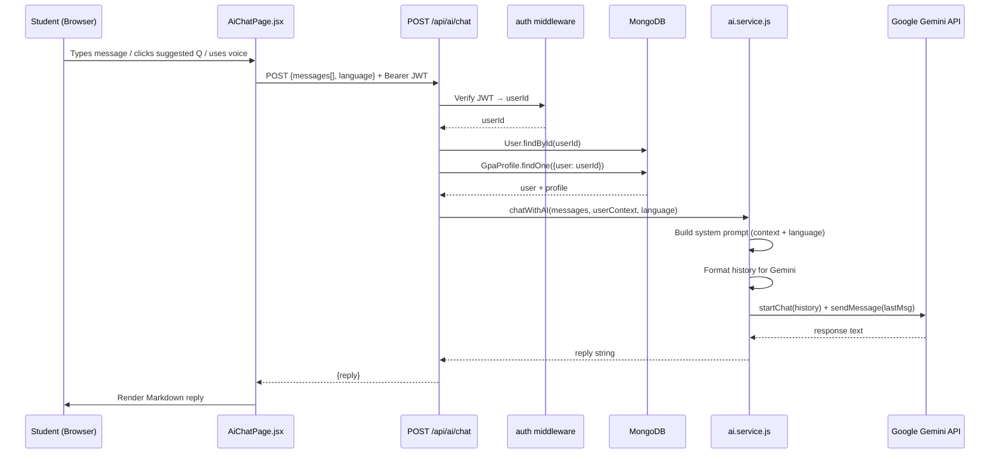

# Design Document: AI Chat Assistant

## Overview

The AI Chat Assistant replaces `client/src/pages/AiChatPage.jsx` with a fully bilingual (Sinhala + English), context-aware conversational interface powered by Google Gemini 1.5 Flash. The feature is already partially implemented — the backend endpoint (`POST /api/ai/chat`), the AI service (`server/ai.service.js`), and the existing page all exist. This design formalises the complete, correct implementation and identifies the gaps to close.

The assistant's core value proposition is deep personalisation: every response is grounded in the student's real academic data (CGPA, semester history, module grades, CA marks, study habits, upcoming events) injected into the Gemini system prompt. Students can interact in either language, use voice input, and receive Markdown-formatted responses.

### Key Design Decisions

- **Replace, don't extend**: `AiChatPage.jsx` is replaced wholesale. The existing file already contains most of the UI; the design codifies the correct structure and fills gaps (system feature knowledge in the prompt, proper error handling, test coverage).
- **Stateless backend**: The backend endpoint is stateless — conversation history is owned by the client and sent with every request. This avoids server-side session storage and keeps the architecture simple.
- **Context injection at request time**: Student context is fetched fresh on every chat request, ensuring the AI always has up-to-date data without a caching layer.
- **Gemini Chat API**: The multi-turn `startChat` / `sendMessage` pattern is used rather than single-turn `generateContent`, so Gemini natively handles conversation context.

---

## Architecture



### Component Boundaries

```
client/src/pages/AiChatPage.jsx   ← complete UI replacement (React)
server/index.js                   ← POST /api/ai/chat route (already exists)
server/ai.service.js              ← chatWithAI(), detectLanguage() (already exists)
server/middleware/auth.js         ← JWT protect middleware (already exists)
server/models/User.js             ← User schema (already exists)
server/models/GpaProfile.js       ← GpaProfile schema (already exists)
```

No new files are required on the backend. The frontend page is a full replacement.

---

## Components and Interfaces

### Backend: `POST /api/ai/chat`

Already registered in `server/index.js`. Protected by the `protect` middleware.

**Request body:**
```json
{
  "messages": [
    { "role": "user",      "content": "string" },
    { "role": "assistant", "content": "string" }
  ],
  "language": "auto" | "english" | "sinhala"
}
```

**Success response (200):**
```json
{ "reply": "string (Markdown)" }
```

**Error responses:**
- `400` — missing or empty `messages` array
- `401` — missing or invalid JWT
- `404` — user not found in DB
- `500` — Gemini API failure or service not configured

### Backend: `ai.service.js` — `chatWithAI(messages, userContext, language)`

Already implemented. Key behaviours:
- Builds a bilingual system prompt from `ACADAMIX_SYSTEM_CONTEXT_ENGLISH` / `ACADAMIX_SYSTEM_CONTEXT_SINHALA`
- Appends full student profile (name, university, degree, CGPA, all semesters, modules, habits, events)
- Strips leading assistant messages from history before passing to Gemini (Gemini requires history to start with a user turn)
- Uses `model.startChat({ history, systemInstruction })` + `chat.sendMessage(lastMessage)`

**Gap to close**: The system prompt does not currently include AcadamiX feature descriptions (Requirement 3). A `SYSTEM_FEATURE_KNOWLEDGE` block must be appended to both language contexts.

### Frontend: `AiChatPage.jsx`

The page is a self-contained React component. It receives `user` as a prop from `App.jsx`.

**Sub-components (inline, no separate files needed):**

| Element | Responsibility |
|---|---|
| Header | Title, language selector (Auto/EN/SI), clear button, voice status badge |
| SuggestedQuestions | Shown only when `messages.length <= 1`; hides after first send |
| MessageList | Scrollable list; user bubbles right, assistant bubbles left with Markdown |
| LoadingBubble | Three-dot bounce animation while awaiting response |
| InputBar | Textarea (Enter to send), mic button (conditional on Web Speech API support), send button |

**State:**
```
messages:      Message[]       // full conversation history
input:         string          // current textarea value
loading:       boolean         // awaiting API response
isListening:   boolean         // voice recognition active
language:      'auto'|'english'|'sinhala'
voiceSupported: boolean        // computed once on mount
```

**Key interactions:**
- `sendMessage(text?)` — appends user message, calls `POST /api/ai/chat`, appends reply
- `handleVoice()` — toggles Web Speech API recognition; populates `input` on result
- `clearChat()` — `window.confirm` → reset to initial greeting
- `handleKeyDown` — Enter (no Shift) triggers `sendMessage()`

### Language Selector

Three pill buttons: `🌍 Auto`, `EN`, `SI`. Active state highlighted in green (`bg-[#22c55e] text-black`). Switching language does not clear the conversation.

### Voice Input

Uses `window.SpeechRecognition || window.webkitSpeechRecognition`. Locale is `si-LK` for Sinhala, `en-US` for English/Auto. The mic button is only rendered when `voiceSupported` is true.

---

## Data Models

### Message (client-side only)

```typescript
interface Message {
  role: 'user' | 'assistant';
  content: string;           // plain text for user, Markdown for assistant
}
```

### ChatRequest (sent to API)

```typescript
interface ChatRequest {
  messages: Message[];
  language: 'auto' | 'english' | 'sinhala';
}
```

### ChatResponse (received from API)

```typescript
interface ChatResponse {
  reply: string;   // Markdown-formatted AI response
}
```

### UserContext (server-side, built per request)

```typescript
interface UserContext {
  user: {
    name: string;
    email: string;
    university: string;
    degreeProgram: string;
  };
  profile: GpaProfile | {};   // empty object if no profile exists
}
```

`GpaProfile` matches the Mongoose schema in `server/models/GpaProfile.js`:
- `cgpa`, `wgpa`, `totalCredits`
- `semesters[]` → each with `key`, `title`, `year`, `semesterGpa`, `targetGpa`, `modules[]`
- `modules[]` → `code`, `name`, `credits`, `grade`, `caMarks`
- `supportTools.habits[]`, `supportTools.events[]`

### System Prompt Structure (server-side)

```
[Language-specific base context]
  + [Student profile block]
      - Name, university, degree, CGPA
      - Per-semester: GPA, target GPA, modules with grades/credits/CA
      - Study habits
      - Upcoming events
  + [AcadamiX feature knowledge block]   ← gap to close
  + [Language instruction footer]
```


---

## Correctness Properties

*A property is a characteristic or behavior that should hold true across all valid executions of a system — essentially, a formal statement about what the system should do. Properties serve as the bridge between human-readable specifications and machine-verifiable correctness guarantees.*

### Property 1: Language detection threshold

*For any* string, `detectLanguage` SHALL return `'sinhala'` if and only if the string contains more than 3 Sinhala Unicode characters (U+0D80–U+0DFF), and `'english'` otherwise.

**Validates: Requirements 1.2**

---

### Property 2: System prompt contains all student context fields

*For any* user profile (with arbitrary name, university, degree, CGPA) and GPA profile (with arbitrary semesters, modules, habits, and events), the system prompt string built by `chatWithAI` SHALL contain the student's name, university, degree program, CGPA, every semester's GPA, every module name and grade, every habit title, and every event title.

**Validates: Requirements 2.2, 2.3, 2.4**

---

### Property 3: Message role determines alignment class

*For any* array of messages with arbitrary roles and content, the rendered `AiChatPage` SHALL apply a right-align CSS class to every user message bubble and a left-align CSS class to every assistant message bubble.

**Validates: Requirements 4.1**

---

### Property 4: Suggested questions match language mode

*For any* language mode value (`'auto'`, `'english'`, `'sinhala'`), when the chat has only the initial greeting message, the rendered suggested questions SHALL be the Sinhala set if and only if the mode is `'sinhala'`, and the English set for all other modes.

**Validates: Requirements 5.2**

---

### Property 5: Voice recognition locale matches language mode

*For any* language mode value, when voice recognition is started, the `recognition.lang` property SHALL be `'si-LK'` if and only if the mode is `'sinhala'`, and `'en-US'` for all other modes.

**Validates: Requirements 6.4, 6.5**

---

### Property 6: Invalid tokens are always rejected

*For any* string that is not a valid JWT signed with the server's `JWT_SECRET`, a request to `POST /api/ai/chat` with that string as the Bearer token SHALL receive a `401` response.

**Validates: Requirements 8.1, 8.2**

---

### Property 7: User ID isolation

*For any* authenticated request, the user profile and GPA profile fetched by the Chat_API SHALL be queried using exclusively the `userId` decoded from the request's JWT, never any value from the request body.

**Validates: Requirements 8.3**

---

### Property 8: Full conversation history is sent with every message

*For any* conversation of arbitrary length, when the student sends a new message, the `messages` array in the API request body SHALL contain all prior messages in the session plus the new user message, in order.

**Validates: Requirements 10.1**

---

### Property 9: Gemini history excludes leading assistant messages

*For any* message array, the history array passed to Gemini's `startChat` SHALL not begin with a message of role `'model'` — any leading assistant messages SHALL be stripped before the history is constructed.

**Validates: Requirements 10.2, 10.3**

---

## Error Handling

| Scenario | Layer | Behaviour |
|---|---|---|
| Missing / invalid JWT | `auth.js` middleware | Returns `401 { message: "Authorization token is required." }` or `"Invalid or expired token."` |
| Empty `messages` array | `POST /api/ai/chat` route | Returns `400 { message: "messages array is required" }` |
| User not found in DB | `POST /api/ai/chat` route | Returns `404 { message: "User not found" }` |
| `GEMINI_API_KEY` not set | `ai.service.js` | Throws `"AI service is not configured. Please ensure GEMINI_API_KEY is set."` → propagates as `500` |
| Gemini API call fails | `ai.service.js` | Catches error, throws `"Failed to get response from AI. Please try again."` → propagates as `500` |
| No GPA profile for user | `POST /api/ai/chat` route | Passes `profile = {}` to `chatWithAI`; service builds a general context without student-specific data |
| Network error on client | `AiChatPage.jsx` `sendMessage` | Catches axios error; appends `⚠️ Sorry, something went wrong: {e.message}` as an assistant message |
| Speech recognition error | `AiChatPage.jsx` `handleVoice` | `recognition.onerror` sets `isListening = false`; input field is not modified |
| Speech recognition ends without result | `AiChatPage.jsx` `handleVoice` | `recognition.onend` sets `isListening = false` |

---

## Testing Strategy

### Approach

The feature has a clear pure-function core (`detectLanguage`, system prompt builder, history formatter) surrounded by I/O layers (React UI, Express route, Gemini API). The testing strategy targets the pure core with property-based tests and uses example-based tests for UI interactions and integration tests for the full request path.

### Property-Based Testing

**Library**: [fast-check](https://github.com/dubzzz/fast-check) (JavaScript/TypeScript, works with Vitest and Jest).

Each property test runs a **minimum of 100 iterations**.

Tag format: `// Feature: ai-chat-assistant, Property {N}: {property_text}`

| Property | Test file | What varies |
|---|---|---|
| P1: Language detection threshold | `ai.service.test.js` | Strings with 0–100 Sinhala Unicode chars |
| P2: System prompt completeness | `ai.service.test.js` | Random user/profile objects |
| P3: Message role alignment | `AiChatPage.test.jsx` | Random message arrays |
| P4: Suggested questions by language | `AiChatPage.test.jsx` | Language mode values |
| P5: Voice locale by language | `AiChatPage.test.jsx` | Language mode values |
| P6: Invalid tokens rejected | `chat.route.test.js` | Random non-JWT strings |
| P7: User ID isolation | `chat.route.test.js` | Random userIds |
| P8: Full history sent | `AiChatPage.test.jsx` | Conversation arrays of random length |
| P9: Gemini history strips leading assistant | `ai.service.test.js` | Message arrays with varying leading roles |

### Unit / Example-Based Tests

- Language selector buttons render (3 buttons: Auto, EN, SI)
- Switching language preserves existing messages
- Enter key triggers `sendMessage`; Shift+Enter does not
- Loading bubble renders while `loading=true`
- Error response from API renders inline error message
- Suggested questions hidden after first message sent
- Clicking suggested question calls `sendMessage` with that text
- Clear button triggers `window.confirm`; confirm resets to 1 message; cancel preserves messages
- Mic button absent when `voiceSupported=false`
- Speech recognition result populates input field
- Speech recognition error resets `isListening` without changing input

### Integration Tests

- `POST /api/ai/chat` with valid JWT fetches correct user and profile from DB
- Language parameter flows through route → service → Gemini call
- Missing `GEMINI_API_KEY` returns 500 with descriptive message
- Gemini API failure returns 500 with human-readable message

### What Is Not Tested

- AI response quality / language correctness (external Gemini behavior)
- Navigation guidance accuracy (AI knowledge, not our code)
- Visual aesthetics (Tailwind classes, animations)
- `window.scrollIntoView` DOM behavior (browser API)
