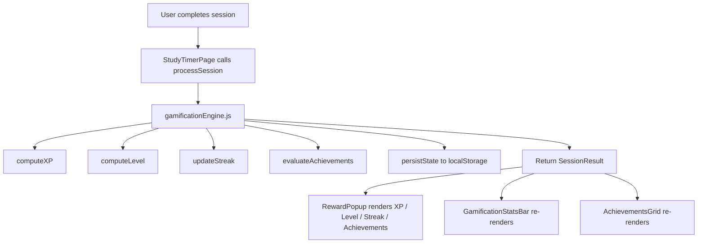

# Design Document: Study Timer Gamification

## Overview

This feature adds a gamification layer on top of the existing `StudyTimerPage` in AcadamiX. It introduces XP points, levels, daily streaks, and achievements to make study sessions feel rewarding. All state is stored in `localStorage` under the key `acadamiX_gamification`, keeping the feature entirely client-side with no backend changes.

The design extracts gamification logic into a pure utility module (`gamificationEngine.js`) that is independent of React, making it straightforward to test and reason about. The existing `StudyTimerPage` is updated to consume this engine and render the new UI elements.

---

## Architecture

The feature follows a clean separation between logic and presentation:

```
localStorage
  ├── acadamiX_study_sessions   (existing — untouched)
  └── acadamiX_gamification     (new — owned by gamification engine)

client/src/utils/
  └── gamificationEngine.js     (pure functions: XP, level, streak, achievements)

client/src/pages/
  └── StudyTimerPage.jsx        (updated: consumes engine, renders new UI)

client/src/components/
  ├── GamificationStatsBar.jsx  (new: Level / XP / Streak / Total Minutes bar)
  ├── RewardPopup.jsx           (new: replaces existing completion modal)
  └── AchievementsGrid.jsx      (new: badge cards for all achievements)
```



---

## Components and Interfaces

### `gamificationEngine.js`

A pure utility module with no React dependencies. All functions are stateless except for the two that read/write `localStorage`.

```js
// Default state shape
const DEFAULT_STATE = {
  xp: 0,
  level: 1,
  streak: 0,
  lastSessionDate: null,   // ISO date string "YYYY-MM-DD" or null
  unlockedAchievements: [] // array of achievement IDs
};

// Load state from localStorage; returns DEFAULT_STATE on missing/corrupt data
function loadState(): GamificationState

// Persist state to localStorage
function saveState(state: GamificationState): void

// Pure: compute XP for a session (0 if < 1 minute)
function computeXP(sessionMinutes: number): number

// Pure: compute level from cumulative XP
function computeLevel(totalXP: number): number

// Pure: compute XP required to reach a given level
function xpForLevel(level: number): number

// Pure: compute progress percentage toward next level (0–100)
function computeProgress(totalXP: number): number

// Pure: update streak given current state and today's date
function updateStreak(state: GamificationState, todayDate: string): GamificationState

// Pure: evaluate and unlock new achievements, returns updated state + list of new IDs
function evaluateAchievements(state: GamificationState, sessionMinutes: number): {
  state: GamificationState,
  newAchievements: string[]
}

// Main entry point called after a session completes
// Reads state, applies all updates, persists, returns SessionResult
function processSession(sessionMinutes: number): SessionResult

// Called on page load to check for streak expiry
function checkStreakOnLoad(): GamificationState
```

**`SessionResult` shape:**
```js
{
  xpEarned: number,
  totalXP: number,
  level: number,
  streak: number,
  leveledUp: boolean,
  newAchievements: string[]  // achievement IDs
}
```

**`GamificationState` shape:**
```js
{
  xp: number,
  level: number,
  streak: number,
  lastSessionDate: string | null,
  unlockedAchievements: string[]
}
```

---

### `GamificationStatsBar.jsx`

Renders the four stats (Level, XP + progress bar, Streak, Total Minutes) above the timer and chart panels. Receives all values as props.

```jsx
<GamificationStatsBar
  level={number}
  totalXP={number}
  progressPercent={number}
  streak={number}
  totalMinutes={number}
/>
```

---

### `RewardPopup.jsx`

Replaces the existing `showCompletionPopup` modal. Receives a `SessionResult` and callbacks.

```jsx
<RewardPopup
  result={SessionResult}
  onStartNew={() => void}
  onDismiss={() => void}
/>
```

Conditionally renders:
- XP earned badge
- Level-up banner (when `result.leveledUp === true`)
- New achievement cards (when `result.newAchievements.length > 0`)
- Streak count

---

### `AchievementsGrid.jsx`

Renders all 10 defined achievements. Unlocked ones show name + icon; locked ones show name + lock icon in a greyed-out style.

```jsx
<AchievementsGrid unlockedIds={string[]} />
```

---

## Data Models

### Gamification Store (`acadamiX_gamification`)

```json
{
  "xp": 1250,
  "level": 4,
  "streak": 5,
  "lastSessionDate": "2025-01-15",
  "unlockedAchievements": ["first_session", "streak_3", "total_60min"]
}
```

### Achievement Definitions (static, in `gamificationEngine.js`)

| ID               | Name              | Condition                                      |
|------------------|-------------------|------------------------------------------------|
| `first_session`  | First Step        | Complete the first ever session                |
| `streak_3`       | On a Roll         | Reach streak of 3                              |
| `streak_7`       | Week Warrior      | Reach streak of 7                              |
| `streak_30`      | Monthly Master    | Reach streak of 30                             |
| `total_60min`    | Hour Scholar      | Accumulate ≥ 60 total minutes                  |
| `total_600min`   | Dedicated Learner | Accumulate ≥ 600 total minutes                 |
| `total_3000min`  | Study Legend      | Accumulate ≥ 3000 total minutes                |
| `single_60min`   | Deep Focus        | Single session ≥ 60 minutes                    |
| `level_5`        | Rising Star       | Reach Level 5                                  |
| `level_10`       | Academic Pro      | Reach Level 10                                 |

### Key Formulas

```
XP per session  = floor(session_minutes × 10)   [0 if session_minutes < 1]
Level           = floor(1 + sqrt(total_xp / 100))
XP for level L  = (L - 1)² × 100
Progress %      = ((total_xp - xp_for_current_level) / (xp_for_next_level - xp_for_current_level)) × 100
```

---

## Correctness Properties

*A property is a characteristic or behavior that should hold true across all valid executions of a system — essentially, a formal statement about what the system should do. Properties serve as the bridge between human-readable specifications and machine-verifiable correctness guarantees.*

### Property 1: XP formula correctness

*For any* session duration ≥ 1 minute, the XP awarded SHALL equal `Math.floor(minutes × 10)`, and for any duration < 1 minute the XP awarded SHALL equal 0.

**Validates: Requirements 1.1, 1.2**

---

### Property 2: XP persistence round-trip

*For any* prior XP total and any session duration, after calling `processSession`, reading the `acadamiX_gamification` key from `localStorage` SHALL return a state whose `xp` field equals the prior total plus the XP earned in that session.

**Validates: Requirements 1.3, 6.1, 6.2**

---

### Property 3: Level formula correctness

*For any* non-negative XP value, `computeLevel(xp)` SHALL equal `Math.floor(1 + Math.sqrt(xp / 100))`.

**Validates: Requirements 2.1**

---

### Property 4: Level-up detection and progress accuracy

*For any* XP value that crosses a level boundary (i.e., `computeLevel(newXP) > computeLevel(oldXP)`), the `processSession` result SHALL have `leveledUp === true` and the stored level SHALL equal `computeLevel(newXP)`. Additionally, for any XP value, `computeProgress(xp)` SHALL be in the range [0, 100).

**Validates: Requirements 2.2, 2.4**

---

### Property 5: Streak increment on consecutive days

*For any* streak value and any pair of consecutive calendar dates where both have sessions, calling `updateStreak` on the second date SHALL return a streak equal to the prior streak plus 1.

**Validates: Requirements 3.2**

---

### Property 6: Streak reset on gap

*For any* streak value, if the last session date is not the day immediately before today, calling `updateStreak` SHALL return a streak of 1 (new session starts a fresh streak).

**Validates: Requirements 3.3**

---

### Property 7: Streak idempotence on same-day sessions

*For any* streak value, completing a second session on the same calendar date SHALL leave the streak unchanged.

**Validates: Requirements 3.4**

---

### Property 8: Streak expiry on page load

*For any* streak value, if the last recorded session date is more than 1 calendar day before today, `checkStreakOnLoad` SHALL return a state with `streak === 0`.

**Validates: Requirements 3.6**

---

### Property 9: Achievement unlock correctness and idempotence

*For any* gamification state, after calling `evaluateAchievements`, every achievement whose condition is met SHALL appear exactly once in `unlockedAchievements` — regardless of how many times `evaluateAchievements` is called with the same state.

**Validates: Requirements 4.2, 4.3**

---

### Property 10: Sessions key isolation

*For any* sequence of gamification operations (XP award, level update, streak update, achievement unlock), the value stored at `acadamiX_study_sessions` in `localStorage` SHALL remain byte-for-byte identical to its value before those operations.

**Validates: Requirements 6.4**

---

### Property 11: Reward popup renders all session result fields

*For any* `SessionResult`, the rendered `RewardPopup` SHALL contain the XP earned value, the current level number, and the streak count. When `leveledUp` is true, it SHALL also contain the new level number in a level-up message. When `newAchievements` is non-empty, every achievement ID in the list SHALL correspond to a rendered achievement name in the popup.

**Validates: Requirements 5.1, 5.2, 5.3**

---

## Error Handling

| Scenario | Behaviour |
|---|---|
| `acadamiX_gamification` key missing | `loadState` returns `DEFAULT_STATE` |
| `acadamiX_gamification` value is invalid JSON | `loadState` catches the parse error, discards the value, returns `DEFAULT_STATE` |
| `sessionMinutes` is `NaN` or negative | `computeXP` treats it as 0, awards 0 XP |
| `localStorage` write fails (e.g. storage quota) | Error is caught and silently swallowed; in-memory state remains correct for the current session |
| `lastSessionDate` is a malformed date string | Streak comparison treats it as null, resets streak to 1 |

---

## Testing Strategy

### Unit / Property-Based Tests

The `gamificationEngine.js` module is a set of pure functions and is the primary target for automated testing. The project uses **Vitest** (already present in the server workspace); a `vitest` dev dependency will be added to the client workspace alongside `fast-check` for property-based testing.

**Property-based tests** (minimum 100 iterations each, using `fast-check`):

Each test is tagged with a comment in the format:
`// Feature: study-timer-gamification, Property N: <property text>`

- Property 1 — `fc.float({ min: 0, max: 300 })` → verify XP formula and zero-XP edge case
- Property 2 — `fc.integer({ min: 0 })` × `fc.float({ min: 1, max: 300 })` → verify XP persistence round-trip with mocked `localStorage`
- Property 3 — `fc.integer({ min: 0, max: 100000 })` → verify level formula
- Property 4 — generate XP pairs that straddle level boundaries → verify `leveledUp` flag and progress range
- Property 5 — `fc.integer({ min: 0, max: 365 })` for streak, consecutive date pairs → verify streak increment
- Property 6 — `fc.integer({ min: 0, max: 365 })` for streak, non-consecutive date pairs → verify streak reset to 1
- Property 7 — `fc.integer({ min: 0, max: 365 })` for streak, same-date pair → verify streak unchanged
- Property 8 — `fc.integer({ min: 0, max: 365 })` for streak, date > 1 day ago → verify streak resets to 0
- Property 9 — `fc.record(...)` generating arbitrary gamification states → verify achievement idempotence
- Property 10 — arbitrary operation sequences → verify `acadamiX_study_sessions` key unchanged

**Example-based unit tests:**

- `loadState` returns `DEFAULT_STATE` when key is absent
- `loadState` returns `DEFAULT_STATE` when key contains invalid JSON
- `processSession(0.5)` awards 0 XP
- `processSession(25)` awards 250 XP
- `computeLevel(0)` returns 1, `computeLevel(100)` returns 2, `computeLevel(400)` returns 3
- Each of the 10 achievements unlocks at its exact threshold condition
- `RewardPopup` renders level-up banner only when `leveledUp === true`
- `AchievementsGrid` renders locked state for achievements not in `unlockedIds`

### Integration / Smoke Tests

- Manual smoke test: run the timer to completion in the browser, verify the `RewardPopup` appears with correct XP, level, and streak values, and that `localStorage` is updated correctly.
- Manual smoke test: verify that `acadamiX_study_sessions` is not modified after a gamification operation.
